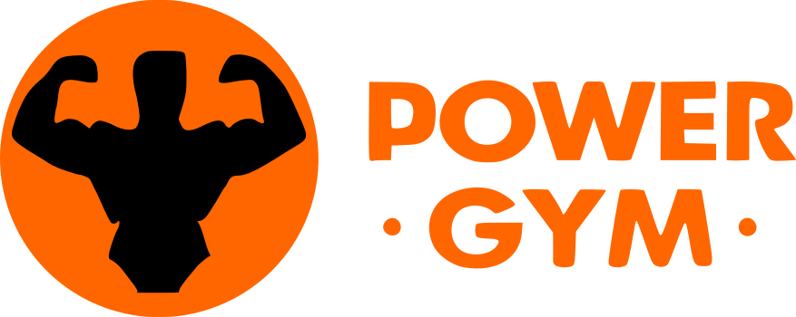

# Proyecto Final: PowerGYM

Este proyecto es una aplicación web de un Gym.

## Logotipo

## Aplicación Web con React y Vite

Esta aplicación realizada en forma grupal corresponde al Proyecto Final del curso Desarrollador Full Stack dictado por RollingCodeSchool.

## Alcance del proyecto

El objetivo del sistema Gimnasio es poder administrar la carga y gestión de usuarios y reserva de clases de un Gimnasio. Además se mostrará una sección informativa donde se exhibirá información del
Gimnasio, servicios y productos que ofrece.

## Enunciado - Requerimientos

Desarrollar una aplicación web sobre un Gimnasio que incluya las siguientes páginas:

- Página principal: debe contener información destacada del Gimnasio, servicios que ofrece, algunos productos que pueden ser adquiridos en el Gimnasio, publicidad de marcas con las que trabajamos, además de comentarios de nuestros clientes, también se debe mostrar los profesores que trabajan con nosotros. El Gimnasio ofrece un servicio mensual de entrenamiento, por lo que cuenta con 3 planes:
  Plan solo musculacion
  Plan solo clases
  Plan Full.
  Al seleccionar cualquiera de los tres planes se lo enviara a una página “apartado página detalle de planes” donde ampliamos como trabajará esa página.

- Detalles del Navbar: El navbar debe mostrar el logo de la empresa, el botón de login para los usuarios con los permisos
  suficientes, solo en el caso de ser administradores además se deberá mostrar las opciones para administrar usuarios y clases. El resto de opciones necesarias se deja a criterio del equipo de desarrolladores.
- Detalles del Footer: El footer debe contar con las redes sociales del Gimnasio, información de la ubicación, teléfonos y toda la información extra que quisieran incluir.
- Página detalle de planes: Consultar cualquier plan de la página principal, se debe dirigir a los usuarios a una página con un formulario de consulta el cual contendrá toda la información necesaria para que nos pongamos en contacto con la persona interesada en el plan, al enviar la consulta se debe responder de manera automática al mail del solicitante un mensaje indicando que próximamente nos contactaremos para informarle más del plan, para esto se puede usar la libreríaí EmailJS
- Login: Puede ser una página o ventana modal, con los datos necesarios para loguear a los usuarios. En la primera versión debe permitir ingresar al menos al usuario administrador, con las credenciales necesarias, la contraseña del administrador debe estar encriptada y no puede ser visible, para ello pueden usar la
  siguiente libreríaí https://www.npmjs.com/package/bcryptjs.
- Página principal administrador: La página principal de administración debe contener una bienvenida al administrador del sistema y
  opcionalmente información de la versión del sistema. Además debe mostrar de forma sencilla las clases disponibles para ese dia y los usuarios que se anotaron en dichas clases. Donde tambien se podrá:
  Administrar Usuarios, Clases, etc.

## Páginas Informativas

- Página Sobre Nosotros: Esta página contendrá información del equipo que desarrolló esta web, alguna frase que hable del equipo y
  debajo una galeríaí donde se visualice una foto o avatar de cada miembro del equipo, seguido por el nombre
  de cada uno.
- Página error 404: Diseñar una web con el error 404, esta página deberá ser llamada desde todos los botones o link de nuestro sitio que no tengan una funcionalidad establecida.
- Página de Contacto: Realizar el diseño que considere conveniente, el formulario debe ser completamente validado.
- Registro de usuario y Turno: Agregar una sección de registro de usuarios, los usuarios registrados deberán poder loguarse al sitio y ser
  administrados desde el panel del administrador. El objetivo de que un usuario pueda ingresar a nuestro sitio es para que pueda reservar una clase sin recurrir al administrador. Para esto diseñar las pantallas que considere necesarias.
- Crud de servicios: Agregar en el administrador una sección para poder administrar las clases que se ofrecen,
  estos serán los mismos que se observa en la página principal. El administrador debe poder
  realizar todos los pasos de este CRUD.

## Enlace de Mockups de interfaces

Los mockups de interfaces fueron desarrollados usando la herramienta de software balsamiq.

## Enlace de Trello

🔗 [Grupo 1 - Proyecto Final](https://trello.com/b/WJD7nU0y/proyecto-final-rolling-code)

## Deploy de la aplicación

La aplicación está desplegada en Netlify. Puedes acceder haciendo clic en el siguiente enlace:

🔗 [Power GYM](https://power-gym-g1.vercel.app/)

## Integración con proyecto de Backend

Este proyecto de Frontend se integró a su proyecto Backend correspondiente donde se utilizó la base de datos no relacional de MongoDB para almacenar los datos de los productos del restaurante, usuarios y pedidos realizados.

- #### Repositorio Backend: [Back-RollingGYM-G1](https://github.com/felix9941/Back-RollingGYM-G1.git)

## Tecnologías utilizadas

  
  
  
  
  
  
  
  

- ### Otras:

  - [React-Router-Dom](https://reactrouter.com/en/main/start/tutorial)
  - [React-Hook-Form](https://react-hook-form.com/get-started)
  - [SweetAlert2](https://sweetalert2.github.io/#download)
  - [Json-server](https://github.com/typicode/json-server)
  - [Form-submit](https://formsubmit.co/)
  - [EmailJS](https://www.emailjs.com/)

## Requisitos previos

- Node.js instalado en tu sistema. Puedes descargarlo [aquí](https://nodejs.org/).

## Configuración

1. Clona este repositorio en tu máquina local a través de una terminal:

git clone <[url-del-repositorio](https://github.com/felix9941/Front-RollingGYM-G1.git)>

2. Navega al directorio del proyecto:

cd Front-RollingGYM-G1

3. Instala las dependencias del proyecto:

npm install

4. Crea un archivo .env en la raíz del proyecto y configura las variables de entorno necesarias. Aquí hay un ejemplo:

- API_PRODUCTOS=url

## Crear un proyecto con React usando Vite

Guía de pasos necesarios para crear un nuevo proyecto con React utilizando Vite.

### Pasos

### 1. Crear el proyecto

En tu terminal, navega hasta la carpeta donde deseas crear el proyecto o trabajo práctico.

npm create vite@latest

### 2. Configuración inicial

Después de ejecutar el comando anterior, se te pedirá que ingreses el nombre de tu proyecto. Escribe el nombre deseado y presiona Enter.

Se te pedirá confirmar el nombre del paquete. Selecciona la opción predeterminada (el mismo nombre del proyecto) y presiona Enter.

### 3. Seleccionar opciones

Se te presentará una lista de opciones para elegir el framework. Selecciona la opción de React.

Luego, se te pedirá que elijas el tipo de script a usar. Elige la opción de JavaScript, que utiliza webpack para configurar todo el proyecto de React.

Presiona Enter para confirmar tu selección.

### 4. Configuración final

Una vez confirmadas las opciones, se mostrarán los comandos que debes ejecutar en orden:

- `cd nombreProyecto`: Cambia al directorio del proyecto recién creado.
- `npm install`: Instala las dependencias del proyecto. Este comando solo necesita ejecutarse una vez.
- `npm run dev`: Inicia un servidor de desarrollo interno, similar a live server. Después de ejecutar este comando, se te proporcionará un enlace para acceder al template creado.

### 5. Desarrollo

Una vez que hayas ejecutado el tercer comando y tengas el servidor en funcionamiento, puedes continuar trabajando en tu proyecto desde la terminal de tu editor de código preferido. Para salir del servidor interno en la terminal, simplemente presiona `ctrl + c`.

## Equipo

| Nombre                 | Perfil GitHub                                       |
| ---------------------- | --------------------------------------------------- |
| Duarte Ignacio         | [Ignaci0-Duarte](https://github.com/Ignaci0-Duarte) |
| Figueroa Felix Ignacio | [felix9941](https://github.com/felix9941)           |
| Isasmendi Javier       | [Isas321](https://github.com/Isas321)               |
